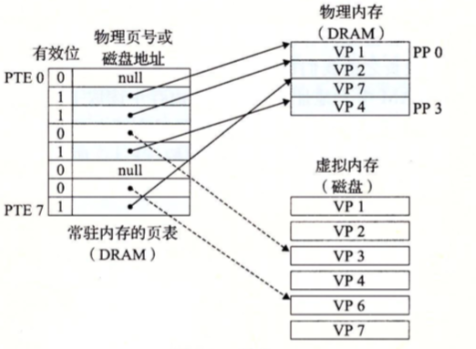
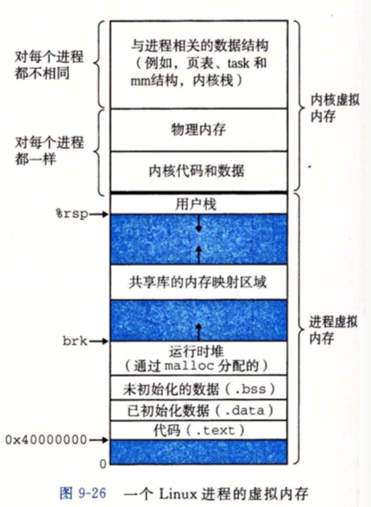
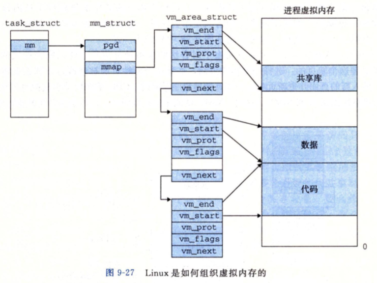
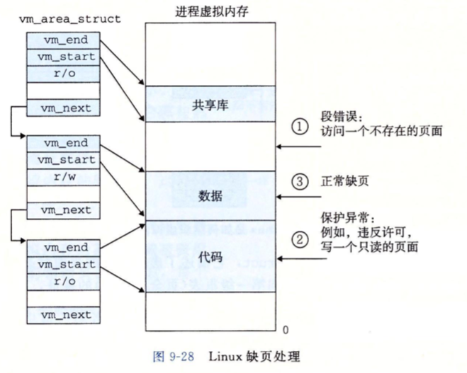

# 【笔记】虚拟内存

该文章是《深入理解计算机系统》中第九章关于 VM 的读书笔记，有大量的原文摘抄，所以本篇文章不在仓库的许可协议之内。如您想了解相关知识请积极购买正版。

虚拟内存提供的三种能力：

- 将主存看成是一个存储在磁盘上的地址空间的高速缓存，在主存中只保存活动区域，并根据需要在磁盘和主存之间来回传送数据；
- 为每个进程提供给了一致的地址空间，从而简化内存管理；
- 保护每个进程的地址空间不被其它进程破坏

## 9.1 物理和虚拟寻址

计算机系统的主存被组织成一个由 M 个连续的子节大小的单元组成的数组。每个字节都有一个唯一的物理地址（Physical Address，PA）。

早起直接物理寻址，现代采用虚拟寻址（virtual addressing）。

从 Virtual address，VA 到 Pysical addres，PA 的过程被称为 Address translation。

## 9.2 地址空间

地址空间（Address space）是一个非负整数地址的有序集合。地址空间的大小有表示最大地址所需的位数来描述。32位、64位地址空间。

地址空间的概念很重要，因为他清楚地区分了数据对象（子节）和它们的属性（地址）。主存中的每个子节都有一个选自虚拟地址空间的虚拟地址和一个选自物理地址空间的物理地址。

虚拟地址空间（Virtual address space）。

## 9.3 虚拟内存作为缓存的工具

虚拟内存被组织位一个由存放在次盘上的 N 个连续的字节大小的单元组成的数组。每个字节都有一个唯一的虚拟地址，作为到数组的索引。

虚拟内存被分为虚拟页（Virtual Page， VP），物理内存被分割为物理页（Physical Pages，PP）

任何时刻，虚拟页面的集合都分为三个不相交的子集：

- 为分配的：VM 系统还为分配的页。未分配的块没有任何数据和它们相关联，因此也就不占用任何磁盘空间。
- 缓存的：当前已缓存在物理内存中的已分配页；
- 为缓存的：为缓存在物理内存中的已分配页。

### 9.3.1 DRAM缓存的组织结构

SRAM 缓存表示位于 CPU 和主存之间的 L1，L2，L3高速缓存

DRAM 缓存表示虚拟内存系统的缓存，他在主存中缓存虚拟页。

虚拟页往往很大，通常是4KB～2MB。

DRAM 总是回写，不是直写。

### 9.3.2 页表

为什么需要页表？因为系统需要一种方法来判断一个虚拟页是不是缓存在 DRAM 中了，是，缓存在哪？不是，即不命中，那么这个虚拟页在磁盘的哪个位置？找到后与要牺牲哪个页？页表就是为了解决这些问题而诞生的方案。

页表负责将虚拟页映射到物理页。其实就是一个页表条目（Page Table Entry，PTE）的数组。

### 9.3.3 页命中

### 9.3.4 缺页

DRAM 混存不命中称为缺页（page fault）

查询页表->为缓存->触发缺页异常->调用内核缺页异常处理->选择牺牲页->将牺牲页复制回磁盘->将目标页复制到原牺牲页的位置->更新页表->返回重新执行导致缺页的指令

交换（swapping）/页面调度（paging）：在磁盘和内存之间传送页的活动。

### 9.3.5 分配页面

### 9.3.6 局部性

抖动（thrashing）页面不断地换进换出。

## 9.4 虚拟内存作为内存管理的工具

操作系统为每个进程提供了一个独立的页表，因而也就是一个独立的虚拟地址空间。

## 9.5 虚拟内存作为内存保护的工具

PTE（Page table entry）上有权限标识。

如果一条指令违反了这些许可条件，那么 CPU 就会触发一个一般保护故障，将控制传递给一个内核中的异常处理程序。Linux shell一般将这种异常报告为“段错误（segmentation fault）

## 9.6 地址翻译

略

## 9.7 案例研究：Intel Core i7/Linux 内存系统

### 9.7.1 Core i7 地址翻译

### 9.7.2 Linux 虚拟内存系统

## 9.8 内存映射

