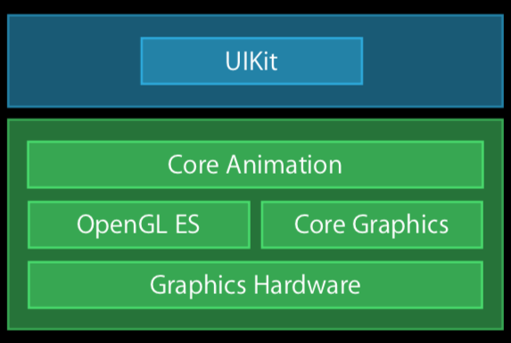
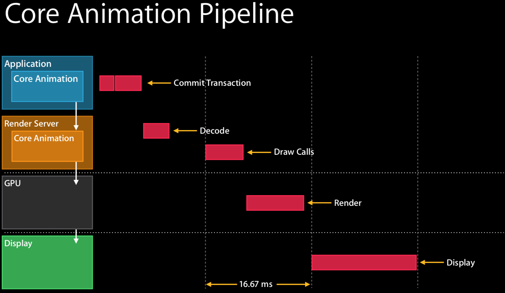

# 由离屏渲染引申开去

一直对离屏渲染有疑惑，始终没能解开，归根结底还是自己基础薄弱，对计算机图形理解的不够。比较巧的是，前天即刻团队突然在网上分享了一篇[《关于iOS离屏渲染的深入研究》](https://zhuanlan.zhihu.com/p/72653360)，一时间获得了不错的转发，果断第一时间拜读，获益颇多，不得不说他们确实花费了不少功夫。但遗憾的是作者对于离屏渲染发生时机，以及为什么不得不“离屏”的原因没能深入阐述，给出一个明确的答案，只是笼统的解释为“不能在单次遍历中完成渲染”。这不但没能打消自己先前的疑虑，反而更加困惑了。所以决定自己动手探究一番。

> ⚠️注意：该文只是自己在探寻离屏渲染过程中的阶段性总结，仅供各位参考。错误之处还望指正。

## 太长不想看
离屏渲染发生在渲染流程中最后的“融合”阶段（包括 stencil 和 blend）。假设有10层待选像素需要融合，默认是从低向上逐层进行的，但是因为“透明”、“遮罩”等效果，不得不需要先融合后面的，然后再与前面的结果进行融合，而这个不得不就是导致离屏渲染的直接原因。因为既要保存先前的融合结果，又要另辟一块地方以便对后面的像素进行融合操作，这就导致了所谓的“离屏”，因为融合过程是发生在帧缓存中的，这块另辟的空间显然需要脱离当前的缓存。

如果看过之后还不甚明了，那么请继续。
## 两个概念
在继续之前，我们先来统一两个概念，可能与你之前的理解有所不同。

#### 什么是离屏渲染？
这里的离屏渲染是指离开当前屏幕帧缓存发生的由硬件加速的渲染处理（严格来说应该是后帧缓存，具体说明请参见 OpenGL 渲染流程一节）。

那么通过 Core Graphics 框架发生的渲染是不是离屏渲染呢？广义上是的，因为它也不是发生在当前屏幕的帧缓存，而是 CPU 单独开辟一块空间进行的。为了与更擅长渲染工作的 GPU 进行区分，这种渲染方式被称为“软渲染”，与“软解码”概念类似。

#### Pipeline
个人猜测，该词很可能来源于工业。石化工业中通过管道将不同处理环节串接起来，人们从几个固定的点对处理过程进行干预，直至最终得到产品。很多书籍中把它直译为“管线”，但是由于中文的语境（context）非常重要，因此直译很容易让人困惑（反正笔者初遇时是迷惑了很久），所以这里把它意译为“流程”或“流水线”，指一系列的承前启后的处理过程。

## UIKit 渲染流程
早期 UIKit 的硬件渲染引擎就是建立在 OpenGL 基础之上的，如下：

 

> 随着 Metal 框架的发布，UIKit 的硬件渲染引擎也随之被替换。Metal 的渲染流程还和 OpenGL 一样吗？不一样，会有哪些变化呢？还有待进一步的考证。

OpenGL 是使用客户端-服务端即 C/S 的形式实现的，很显然 UIKit 也采用了这一模式。我们的 App 可以看作客户端，而 Core Animation 提供的 OpenGL/Metal 实现看作服务端。

> 上图引用自 WWDC 2014 “Advanced Graphics and Aniamtions for iOS Apps”，目前该分享的视频在官方网站上暂时搜索不到，但是一个不存在视频网站上有，欲了解详情，请移步。

从图中可知具体的渲染处理都是有 Render Server 负责的，通过公开的架构图可知： UIKit 的 Render server 正是通过 OpenGL 来实现的。接下来，我们就来了解下 OpenGL。

## OpenGL

### 什么是 OpenGL
OpenGL 是一种应用程序编程接口，它是一个可以对图形硬件设备特性进行访问的软件库，可以用于设置所需的对象、图像和操作，以便开发交互式的三维计算机图形应用程序。

### OpenGL 渲染流程

如上图所示，渲染流程大致分为这么几个阶段。前五个环节与本文讨论内容的关系不是那么密切，所以这里就不展开了，欲了解详情，请详阅参考中所累文章。

接下来我们看下重点，“Test and blending”。

### 测试（Test）

### 帧缓存

### 在这个阶段会使用深度测试（depth test，或者通常也称作 z-buffering）和模板测试（stencil test）的方式来决定一个片元是否可见。

### 融合（blending）

有了上面这些 OpenGL 渲染流程的基础，我们在来看一看 UIKit 是如何渲染？

### 前后帧缓存

## 诱因分析

## 透明
双层透明

### 遮罩

上面的理论假设已经完毕，下面我们来看看如何证明这一假设：

## 证明

### UIKit pipline

### Core Aniamtin guide

### 双透明的例子

### 圆角裁切的例子

### 离屏渲染标黄的截图

### 疑问

- 为什么离屏会有这么高的代价，因为阻塞了主融合“线程”（因为对 GPU 的理解几乎空白，所以这里用线程可能不准确），需要等待子任务的完成吗？
- View 的 mask 会导致离屏渲染吗？有待进一步验证。

### 后记

### 参考

- [《关于iOS离屏渲染的深入研究》](https://zhuanlan.zhihu.com/p/72653360)
- 《OpenGL 编程指南（原书第8版）》作者：Dave Shreiner、Graham Sellers、John Kessenich、Bill Licean-Kane，译者：王锐
- [Learn OpenGL](https://learnopengl.com)
- [OpenGL Rendering Pipeline](http://www.songho.ca/opengl/gl_pipeline.html)
- [https://open.gl/drawing](https://open.gl/drawing)
- [Morden OpenGL](https://glumpy.github.io/modern-gl.html)

